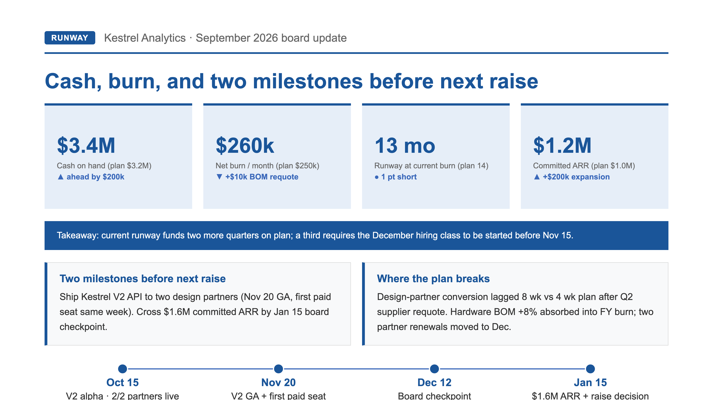

# Case: one-page board update from a fresh brief (Autonomous Slide Deck Engine)

Same engine, different deck. A one-page runway & milestone checkpoint for a
fictional hardware + AI-B2B company — deliberately unlike the 10-page QBR case
next to it. Same `investment-blue-light` master tokens, different structure:
4 metric cards + a takeaway strip + two side-by-side cards + a 4-step timeline,
and no chart.



## How it was built (verbatim chain)

```bash
node modules/render-validate-pptx/scripts/render-deck.mjs --pages demo/d3-single/pages --out demo/d3-single/screenshots
node modules/render-validate-pptx/scripts/check-density.mjs --pages demo/d3-single/pages
node modules/render-validate-pptx/scripts/check-style-consistency.mjs --pages demo/d3-single/pages --contract demo/d3-single/planning/02-style-contract.md
python3 demo/d3-single/build-pptx.py
```

Gates: density PASS 1/1, style failures 0. The exported PPTX exposes 30 native
text runs / 937 characters on the one slide — every piece of copy is selectable
and editable in PowerPoint / Keynote. No `shoot-charts` step, because this page
carries no chart.

## What this proves

The engine is not one deck with different words. Same master, different domain,
different page count, different layout blocks — and it still renders, gates, and
exports an editable deck in about two seconds. The HTML page and the per-deck
`build-pptx.py` are authored (by you or your agent) from the master; the engine
does the rendering, the density/style gates, and the PPTX assembly.

## Get the engine

Paid pack ($39 one-time, includes 3 executive decision prompts as a gift):
https://whop.com/checkout/plan_P5fENUFVVrexP/?source=github-sample
