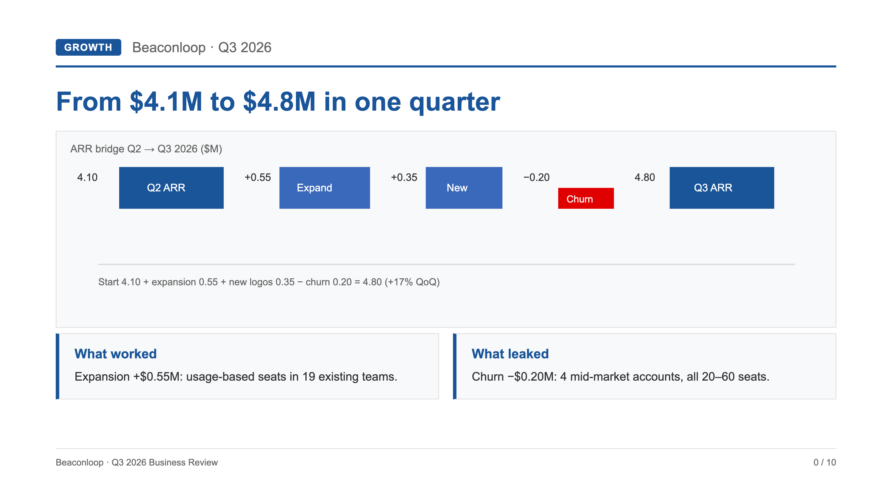

# Case: 10-slide QBR deck from one brief (Autonomous Slide Deck Engine)

Fictional company, real pipeline. Brief: a Q3 business review for a 40-seat SaaS
(`brief-excerpt.md`). Output: 10 pages on the `investment-blue-light` master —
render below is slide 4, the revenue-bridge chart (3x capture; all copy on every
slide stays native editable text in the PPTX).



## How it was built (verbatim chain)

```bash
node modules/ppt-production-orchestrator/scripts/init-deck-project.mjs --out demo/qbr-project --title "Beaconloop Q3 2026 Business Review"
node modules/render-validate-pptx/scripts/render-deck.mjs --pages demo/qbr-project/pages --out demo/qbr-project/screenshots
node modules/render-validate-pptx/scripts/check-density.mjs --pages demo/qbr-project/pages
node modules/render-validate-pptx/scripts/check-style-consistency.mjs --pages demo/qbr-project/pages --contract demo/qbr-project/planning/02-style-contract.md
node modules/render-validate-pptx/scripts/shoot-charts.mjs "$PWD/demo/qbr-project/pages/04-bridge.html" "$PWD/demo/qbr-project/charts/"
python3 demo/qbr-project/build-pptx.py
```

Gates: density PASS 10/10, style failures 0, every PPTX slide exposes real text
frames (verified with python-pptx).

## Failure boundaries (all exercised, none print PASS on bad input)

- Empty pages dir → `render-deck.mjs` exits 1: `no .html files found`.
- Missing chart PNG → `build-pptx.py` exits 3 with the exact recovery command.
- Tiny-font cram passes the density gate (coverage-only) — documented buyer-side
  limit: keep body copy ≥ 16px. Missing fonts fall back silently — pin Arial or
  install your brand font in the build environment.

## Get the engine

Paid pack ($39 one-time, includes 3 executive decision prompts as a gift):
https://whop.com/checkout/plan_P5fENUFVVrexP/?source=github-sample
